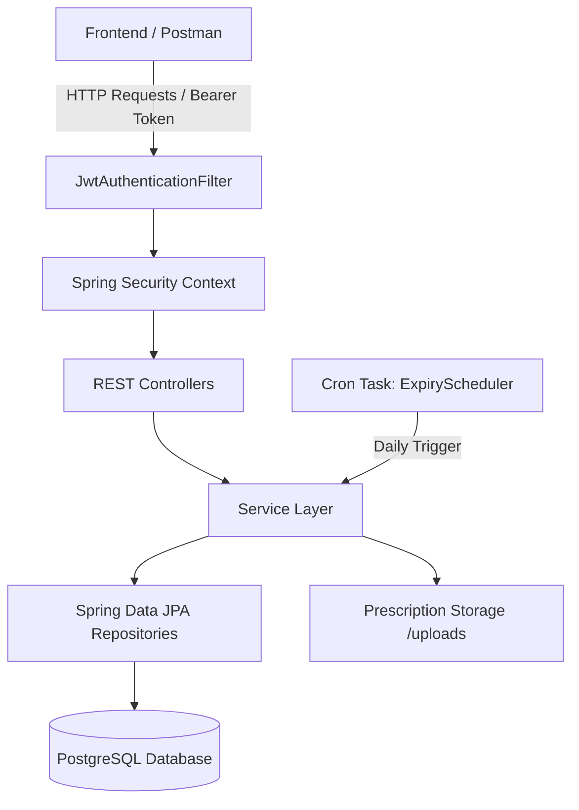

# MediStock Backend API 🏥⚙️

[](https://www.oracle.com/java/)
[](https://spring.io/projects/spring-boot)
[](https://spring.io/projects/spring-security)
[](https://www.postgresql.org/)
[](http://localhost:8081/swagger-ui.html)
[]()

> **MediStock Backend** is an enterprise-grade RESTful API service powering the MediStock Medical Inventory Management Platform. Built on **Spring Boot 3.3.2** and **Java 21**, it delivers role-based access control, real-time inventory tracking, batch expiry automation, procurement workflows, prescription handling, POS sales billing, and analytics reporting.

---

## 📑 Table of Contents

- [Key Highlights](#-key-highlights)
- [Architecture & Tech Stack](#-architecture--tech-stack)
- [Directory Structure](#-directory-structure)
- [Role-Based Access Control (RBAC)](#-role-based-access-control-rbac)
- [Core Functional Modules](#-core-functional-modules)
- [Prerequisites & Dependencies](#-prerequisites--dependencies)
- [Configuration & Environment Variables](#-configuration--environment-variables)
- [Database Setup & Schema](#-database-setup--schema)
- [Build & Run Instructions](#-build--run-instructions)
- [API Reference Catalog](#-api-reference-catalog)
- [Automated Scheduled Tasks](#-automated-scheduled-tasks)
- [Default Seed Accounts](#-default-seed-accounts)
- [Troubleshooting & FAQs](#-troubleshooting--faqs)

---

## 🚀 Key Highlights

* **Stateless JWT Security**: Secure authentication filter with token issuance, 24-hour expiration, and role claim extraction.
* **Granular RBAC**: Strict multi-role permission model supporting `ADMIN`, `PHARMACIST`, `STORE_MANAGER`, `STAFF`, and `SUPPLIER`.
* **Automated Expiry Tracker**: Background cron task that automatically marks batches as `EXPIRING_SOON` (<30 days) or `EXPIRED`.
* **Audit-Proof Stock Logging**: Automatic logging of every stock movement (`IN`, `OUT`, `ADJUSTMENT`) with user attribution and reason codes.
* **Prescription & POS System**: File storage integration for uploaded medical prescriptions, validation workflow, and itemized invoice generation.
* **In-App Messaging**: Inter-role communication channel linked directly to purchase orders between hospital staff and suppliers.
* **Exportable Reporting Engine**: Native CSV export endpoints for inventory catalogs, low stock alerts, audit trails, and supplier orders.
* **Interactive OpenAPI 3.0**: Embedded Swagger UI documentation for live endpoint testing.

---

## 🛠️ Architecture & Tech Stack



| Layer / Concern | Technology | Version / Details |
| :--- | :--- | :--- |
| **Language & Runtime** | Java | OpenJDK 21 LTS |
| **Framework** | Spring Boot | 3.3.2 |
| **Security & Auth** | Spring Security + JJWT | 0.12.6 (HMAC-SHA256) |
| **Data Persistence** | Spring Data JPA / Hibernate | Object-Relational Mapping with PostgreSQL Dialect |
| **Primary Database** | PostgreSQL | Port 5432 (`medistock_db`) |
| **API Documentation** | SpringDoc OpenAPI Starter | 2.6.0 (Swagger UI v3) |
| **Validation** | Jakarta Bean Validation | `@Valid`, `@NotBlank`, `@Min`, etc. |
| **Build Tool** | Apache Maven | Maven Wrapper / CLI |

---

## 📂 Directory Structure

```text
medistock-backend/
├── pom.xml                               # Project dependencies and build configuration
├── kill8081.bat                          # Helper utility to free port 8081 on Windows
├── uploads/                              # Uploaded prescription file storage directory
│   └── prescriptions/
├── src/
│   ├── main/
│   │   ├── java/com/medistock/
│   │   │   ├── MedistockApplication.java # Main Spring Boot entrypoint & @EnableScheduling
│   │   │   │
│   │   │   ├── config/                   # System & Security Configuration
│   │   │   │   ├── DataInitializer.java  # Seeds roles, admin, suppliers & demo catalog
│   │   │   │   └── SecurityConfig.java   # Filter chain, CORS, password encoder & path rules
│   │   │   │
│   │   │   ├── controller/               # REST API Controllers (17 endpoints)
│   │   │   │   ├── AlertController.java
│   │   │   │   ├── AnalyticsController.java
│   │   │   │   ├── AuthController.java
│   │   │   │   ├── CustomerController.java
│   │   │   │   ├── DashboardController.java
│   │   │   │   ├── ExpiryTrackingController.java
│   │   │   │   ├── InventoryController.java
│   │   │   │   ├── MedicineController.java
│   │   │   │   ├── MessageController.java
│   │   │   │   ├── NotificationController.java
│   │   │   │   ├── PrescriptionController.java
│   │   │   │   ├── PurchaseOrderController.java
│   │   │   │   ├── ReportController.java
│   │   │   │   ├── SaleController.java
│   │   │   │   ├── StockLogController.java
│   │   │   │   ├── SupplierController.java
│   │   │   │   └── UserController.java
│   │   │   │
│   │   │   ├── dto/                      # Data Transfer Objects & Request/Response records
│   │   │   ├── entity/                   # JPA Database Entities (15 mapped tables)
│   │   │   │   ├── Customer.java
│   │   │   │   ├── ExpiryTracking.java
│   │   │   │   ├── Inventory.java
│   │   │   │   ├── Medicine.java
│   │   │   │   ├── Message.java
│   │   │   │   ├── Notification.java
│   │   │   │   ├── Prescription.java
│   │   │   │   ├── PurchaseOrder.java
│   │   │   │   ├── PurchaseOrderItem.java
│   │   │   │   ├── Role.java
│   │   │   │   ├── Sale.java
│   │   │   │   ├── SaleItem.java
│   │   │   │   ├── StockLog.java
│   │   │   │   ├── Supplier.java
│   │   │   │   └── User.java
│   │   │   │
│   │   │   ├── enums/                    # Business Domain Enums
│   │   │   │   ├── ActionType.java       # IN, OUT, ADJUSTMENT
│   │   │   │   ├── ExpiryStatus.java     # ACTIVE, EXPIRING_SOON, EXPIRED
│   │   │   │   ├── NotificationSeverity.java
│   │   │   │   ├── NotificationType.java
│   │   │   │   ├── OrderStatus.java      # PENDING, APPROVED, SHIPPED, RECEIVED, CANCELLED
│   │   │   │   ├── PrescriptionStatus.java # PENDING, APPROVED, REJECTED, DISPENSED
│   │   │   │   └── SaleType.java         # WALK_IN, PRESCRIPTION
│   │   │   │
│   │   │   ├── exception/                # Global exception handling & custom exceptions
│   │   │   ├── repository/               # Spring Data JPA interfaces
│   │   │   ├── security/                 # JWT Provider, CustomUserDetails & Auth Filter
│   │   │   └── service/                  # Business logic interfaces & service implementations
│   │   │       └── impl/
│   │   │
│   │   └── resources/
│   │       └── application.yml           # Spring properties, DB credentials, JWT & scheduler
│   │
│   └── test/                             # Unit and integration test suites
```

---

## 👥 Role-Based Access Control (RBAC)

The application enforces fine-grained authorization via Spring Security method & URL security:

| Role | Key Permissions & Responsibilities |
| :--- | :--- |
| **`ROLE_ADMIN`** | Complete system authority: User CRUD, inventory control, purchase order approvals, prescription reviews, and full CSV exports. |
| **`ROLE_STORE_MANAGER`** | Stock In/Out operations, physical count adjustments, supplier orders, minimum threshold configuration. |
| **`ROLE_PHARMACIST`** | POS sales checkout, prescription validation, customer directory management, and medicine lookup. |
| **`ROLE_STAFF`** | View-only access to medicine directory, stock status, and audit logs. |
| **`ROLE_SUPPLIER`** | Isolated portal access to view assigned purchase orders, update shipping statuses, and communicate with the store. |

---

## ⚙️ Prerequisites & Dependencies

Before running the backend, ensure your environment satisfies:

1. **Java Development Kit (JDK)**: `v21` or later (`java -version`).
2. **Apache Maven**: `v3.8+` (`mvn -version`).
3. **PostgreSQL Server**: `v14+` running locally on port `5432`.
4. **Postman** *(optional)*: For direct endpoint exploration via the repository's `Postman_Collection.json`.

---

## 🔧 Configuration & Environment Variables

All core properties are configured in [`src/main/resources/application.yml`](file:///c:/Users/vishn/week-1%20task/medistock/medistock-backend/src/main/resources/application.yml). You can customize them directly or inject environment variables:

```yaml
server:
  port: 8081

spring:
  application:
    name: medistock
  datasource:
    url: ${SPRING_DATASOURCE_URL:jdbc:postgresql://localhost:5432/medistock_db}
    username: ${SPRING_DATASOURCE_USERNAME:postgres}
    password: ${SPRING_DATASOURCE_PASSWORD:vishnu210}
    driver-class-name: org.postgresql.Driver
  jpa:
    hibernate:
      ddl-auto: update
    properties:
      hibernate:
        dialect: org.hibernate.dialect.PostgreSQLDialect
        format_sql: true

app:
  jwt:
    secret: bWVkaXN0b2NrLWp3dC1zZWNyZXQta2V5LWZvci1hdXRoZW50aWNhdGlvbi0yMDI1LXNlY3VyZS1rZXktbXVzdC1iZS1sb25n
    expiration-ms: 86400000          # 24 Hours
    refresh-expiration-ms: 604800000     # 7 Days

medistock:
  expiry:
    threshold-days: 30               # Mark batch as EXPIRING_SOON if <= 30 days
  scheduler:
    expiry-cron: "0 0 1 * * ?"       # Executes daily at 1:00 AM UTC
```

### Key Environment Variables

| Variable | Description | Default |
| :--- | :--- | :--- |
| `SPRING_DATASOURCE_URL` | PostgreSQL JDBC Connection URL | `jdbc:postgresql://localhost:5432/medistock_db` |
| `SPRING_DATASOURCE_USERNAME` | PostgreSQL User | `postgres` |
| `SPRING_DATASOURCE_PASSWORD` | PostgreSQL Password | `vishnu210` |
| `SERVER_PORT` | HTTP Server Port | `8081` |

---

## 🗄️ Database Setup & Schema

1. Open **pgAdmin** or PostgreSQL terminal (`psql`):
   ```sql
   CREATE DATABASE medistock_db;
   ```
2. *(Optional)* Schema and seed scripts are located in `database/`:
   * [`database/schema.sql`](file:///c:/Users/vishn/week-1%20task/medistock/database/schema.sql): Full DDL definitions.
   * [`database/migration_v2.sql`](file:///c:/Users/vishn/week-1%20task/medistock/database/migration_v2.sql): Incremental migrations.
3. On initial startup with `ddl-auto: update`, Hibernate will automatically verify and build the tables. The [`DataInitializer.java`](file:///c:/Users/vishn/week-1%20task/medistock/medistock-backend/src/main/java/com/medistock/config/DataInitializer.java) class automatically seeds roles, test users, sample medicines, suppliers, and initial stock batches.

---

## 🚀 Build & Run Instructions

### 1. Navigate to Backend Directory
```bash
cd medistock-backend
```

### 2. Clean and Build with Maven
```bash
mvn clean install -DskipTests
```

### 3. Run the Spring Boot Server
```bash
mvn spring-boot:run
```

Once running, the server is available at:
* **Base URL**: `http://localhost:8081`
* **Swagger UI API Docs**: `http://localhost:8081/swagger-ui.html`
* **OpenAPI Schema JSON**: `http://localhost:8081/api-docs`

### 4. Package as Executable JAR
```bash
mvn clean package
java -jar target/medistock-backend-1.0.0.jar
```

---

## 📡 API Reference Catalog

All private endpoints require an `Authorization: Bearer <JWT_TOKEN>` header.

### 🔐 1. Authentication (`/api/auth`)
| Method | Endpoint | Description | Public? |
| :--- | :--- | :--- | :--- |
| `POST` | `/api/auth/login` | Authenticate with email/password, returns JWT token & user profile | ✅ Yes |
| `POST` | `/api/auth/register` | Register a new user account | ✅ Yes |

### 💊 2. Medicine Catalogue (`/api/medicines`)
| Method | Endpoint | Description |
| :--- | :--- | :--- |
| `GET` | `/api/medicines` | Paginated search & multi-filter (`search`, `category`, `supplierId`, `stockStatus`, `batchNumber`) |
| `GET` | `/api/medicines/search` | Full-text query on name, generic name, code, manufacturer |
| `GET` | `/api/medicines/{id}` | Fetch individual medicine by primary key |
| `GET` | `/api/medicines/code/{code}` | Fetch medicine by unique SKU / medicine code |
| `POST` | `/api/medicines` | Add medicine to catalogue (automatically initializes inventory tracking) |
| `PUT` | `/api/medicines/{id}` | Update medicine information |
| `DELETE`| `/api/medicines/{id}` | Delete medicine from catalogue |
| `GET` | `/api/medicines/categories` | Retrieve list of unique medicine categories |

### 📦 3. Inventory & Stock Adjustments (`/api/inventory`)
| Method | Endpoint | Description |
| :--- | :--- | :--- |
| `GET` | `/api/inventory` | Paginated listing of stock quantities, minimums, maximums, and locations |
| `GET` | `/api/inventory/low-stock` | Retrieve medicines where `quantity < minimumStock` |
| `GET` | `/api/inventory/out-of-stock` | Retrieve medicines with `0` remaining units |
| `GET` | `/api/inventory/medicine/{medicineId}`| Get stock level for specific medicine ID |
| `POST` | `/api/inventory/stock-in` | Receive incoming stock units (`ActionType.IN`) |
| `POST` | `/api/inventory/stock-out` | Dispatch / deduct units (`ActionType.OUT`) |
| `POST` | `/api/inventory/adjust` | Physical count adjustment (`ActionType.ADJUSTMENT`) |
| `PUT` | `/api/inventory/medicine/{id}/thresholds`| Update minimum stock, maximum stock, and aisle/shelf location |

### ⏳ 4. Expiry Tracking (`/api/expiry`)
| Method | Endpoint | Description |
| :--- | :--- | :--- |
| `GET` | `/api/expiry` | List batch expiry records with pagination |
| `GET` | `/api/expiry/expiring-soon` | Retrieve batches expiring within next 30 days |
| `GET` | `/api/expiry/expired` | Retrieve all expired medicine batches |
| `POST` | `/api/expiry` | Create new batch expiry tracking entry |
| `POST` | `/api/expiry/check-and-update` | Manually trigger expiry evaluation job |
| `POST` | `/api/expiry/dispose/{id}` | Mark expired batch as disposed |

### 🏢 5. Suppliers & Purchase Orders (`/api/suppliers` & `/api/purchase-orders`)
| Method | Endpoint | Description |
| :--- | :--- | :--- |
| `GET` | `/api/suppliers` | List all suppliers |
| `POST` | `/api/suppliers` | Register new pharmaceutical supplier |
| `PUT` | `/api/suppliers/{id}` | Update supplier profile |
| `GET` | `/api/purchase-orders` | List purchase orders with status filtering |
| `POST` | `/api/purchase-orders` | Create procurement order for supplier |
| `PUT` | `/api/purchase-orders/{id}/status` | Transition status (`PENDING` ➔ `APPROVED` ➔ `SHIPPED` ➔ `RECEIVED`) |
| `GET` | `/api/purchase-orders/supplier/{id}` | Filter orders assigned to specific supplier |

### 🧾 6. Sales, POS & Customers (`/api/sales` & `/api/customers`)
| Method | Endpoint | Description |
| :--- | :--- | :--- |
| `POST` | `/api/sales` | Record point-of-sale checkout (deducts stock & generates invoice) |
| `GET` | `/api/sales` | Paginated sales transactions history |
| `GET` | `/api/sales/invoice/{invoiceNo}` | Retrieve itemized bill by invoice number |
| `GET` | `/api/customers` | Search customer registry |
| `POST` | `/api/customers` | Register new customer profile |

### 📋 7. Prescriptions (`/api/prescriptions`)
| Method | Endpoint | Description |
| :--- | :--- | :--- |
| `POST` | `/api/prescriptions` | Upload prescription (multipart `file` + metadata) |
| `GET` | `/api/prescriptions` | List submitted prescriptions |
| `GET` | `/api/prescriptions/{id}/image` | Stream prescription image preview (Public) |
| `PUT` | `/api/prescriptions/{id}/status` | Approve, reject, or mark prescription as dispensed |

### 📊 8. Reports & Analytics (`/api/reports` & `/api/analytics`)
| Method | Endpoint | Description |
| :--- | :--- | :--- |
| `GET` | `/api/analytics/overview` | KPI summaries (total stock, valuations, low stock counts) |
| `GET` | `/api/analytics/sales-trends` | Revenue and volume metrics grouped by timeline |
| `GET` | `/api/reports/inventory` | Download full inventory CSV |
| `GET` | `/api/reports/low-stock` | Download low stock CSV |
| `GET` | `/api/reports/expired` | Download expired batches CSV |
| `GET` | `/api/reports/stock-movement` | Download filtered stock movement audit CSV |
| `GET` | `/api/reports/purchases` | Download purchase orders CSV |

### 💬 9. In-App Messaging & Notifications (`/api/messages` & `/api/notifications`)
| Method | Endpoint | Description |
| :--- | :--- | :--- |
| `GET` | `/api/messages/order/{orderId}` | Conversation thread for a purchase order |
| `POST` | `/api/messages` | Send message to supplier or management |
| `GET` | `/api/notifications` | User's system notifications list |
| `PUT` | `/api/notifications/mark-all-read`| Mark all notifications as read |

---

## ⏰ Automated Scheduled Tasks

The backend utilizes Spring's `@Scheduled` annotation to run maintenance routines automatically:

* **Batch Expiry Job**: Configured to run daily (`0 0 1 * * ?` UTC).
  * Evaluates current dates against `expiryDate`.
  * Flags items `<= 30 days` to `ExpiryStatus.EXPIRING_SOON`.
  * Flags past items to `ExpiryStatus.EXPIRED`.
  * Generates high-priority `Notification` records for store managers.

---

## 🔑 Default Seed Accounts

The [`DataInitializer`](file:///c:/Users/vishn/week-1%20task/medistock/medistock-backend/src/main/java/com/medistock/config/DataInitializer.java) provisions the following testing accounts on startup:

| Role | Email | Password | Primary Use Case |
| :--- | :--- | :--- | :--- |
| **Admin** | `admin@medistock.com` | `admin123` | Complete administrative system control |
| **Store Manager** | `store_manager@medistock.com` | `password123` | Stock in/out, inventory adjustments, orders |
| **Pharmacist** | `pharmacist@medistock.com` | `password123` | POS checkout, billing & prescriptions |
| **Staff** | `staff@medistock.com` | `password123` | Catalog browsing, inventory lookup |
| **Supplier** | `supplier@medistock.com` | `password123` | Supplier portal & purchase order handling |

---

## ❓ Troubleshooting & FAQs

### 1. `Port 8081 is already in use`
If another instance is holding port 8081 on Windows, execute the included batch script:
```cmd
kill8081.bat
```
Or manually via PowerShell:
```powershell
Get-Process -Id (Get-NetTCPConnection -LocalPort 8081).OwningProcess | Stop-Process -Force
```

### 2. `Connection to localhost:5432 refused`
* Verify that your PostgreSQL service is running (`services.msc` -> `postgresql-x64-16`).
* Ensure the database `medistock_db` exists (`CREATE DATABASE medistock_db;`).
* Check credentials in `src/main/resources/application.yml`.

### 3. Prescription Upload Storage
Uploaded files are stored locally under `uploads/prescriptions/`. Ensure the application has read/write permissions to this directory.
